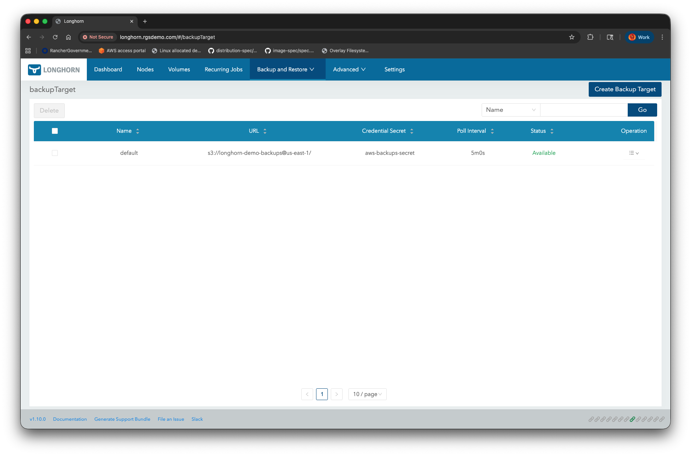
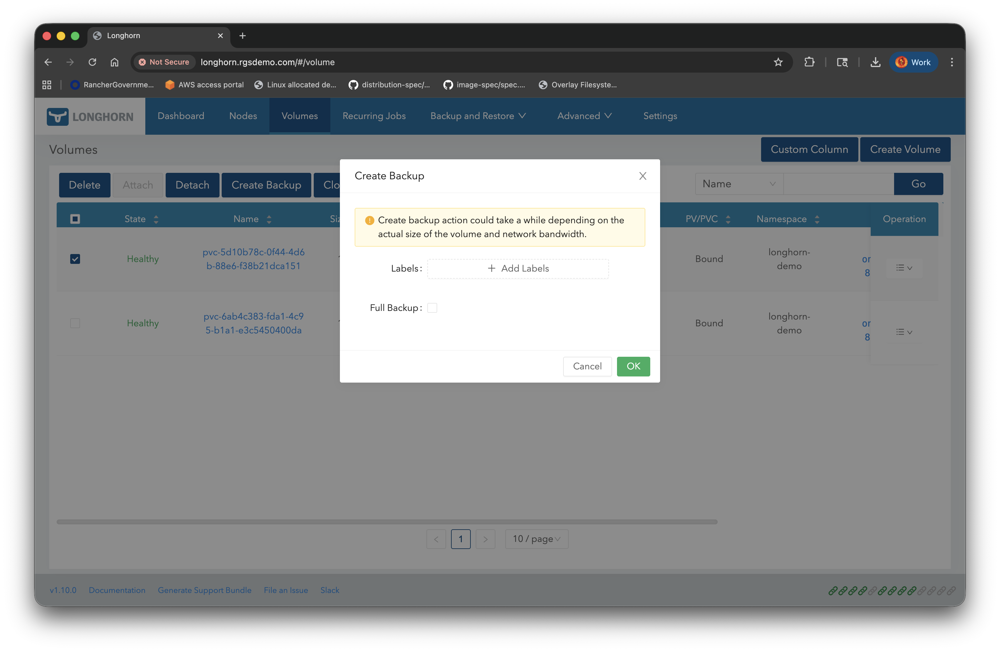
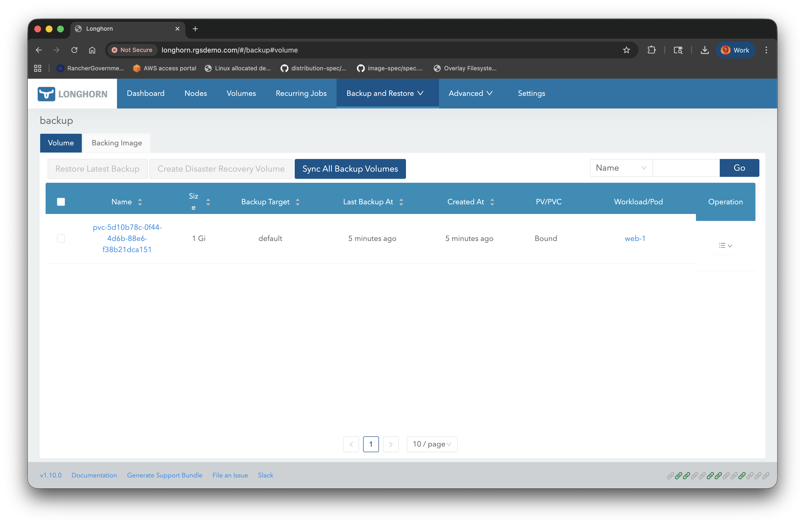
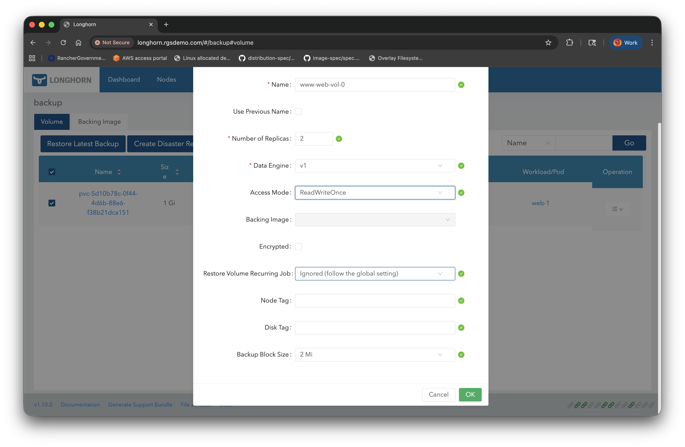
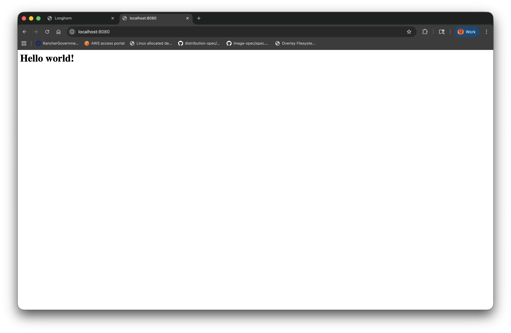

# Volume Backup and Restore

## Default backup target

Longhorn allows you to define backup targets, which may be either network filesystems such as NFS or SMB, or remote object storage. For the demo, we have chosen Amazon S3 as our target. Longhorn always defines a default backup target, which is empty unless the installation is configured with it already set.

An AWS S3 bucket, IAM user, and access key were already created by Terraform when we created the cluster. We can create a secret from the access key to store in Longhorn. Run the following command to create this secret:

```sh
kubectl create secret generic aws-backups-secret \
  --namespace longhorn-system \
  --from-literal=AWS_ACCESS_KEY_ID=$(terraform -chdir=terraform output backups_access_key_id | tr -d '"') \
  --from-literal=AWS_SECRET_ACCESS_KEY=$(terraform -chdir=terraform output backups_secret_access_key | tr -d '"')
```

We can then patch the `longhorn-default-resources` `ConfigMap` to set this as the new default backup target, which is empty on a new Longhorn installation. This can also be set in the Helm values.

```sh
kubectl patch configmap longhorn-default-resource \
  -n longhorn-system \
  --patch-file manifests/default-resources-patch.yaml
```

This is also accessible from the Longhorn UI on the `backups` tab, which can be seen below.



The IAM permissions required are minimal. The backup process needs `GetObject`, `PutObject`, and `DeleteObject` on bucket objects, and `ListBucket` on the bucket itself. In Terraform, this looks like:

```hcl
data "aws_iam_policy_document" "backups" {
  statement {
    effect = "Allow"
    resources = [
      aws_s3_bucket.backups.arn,
      "${aws_s3_bucket.backups.arn}/*"
    ]
    actions = [
      "s3:PutObject",
      "s3:GetObject",
      "s3:DeleteObject",
      "s3:ListBucket"
    ]
  }
}
```

Assuming the bucket was also created by Terraform under the resource address `aws_s3_bucket.backups`. Otherwise, use the bucket name directly.

In the IAM json editor:

```json
{
  "Version": "2012-10-17",
  "Statement": [
    {
      "Effect": "Allow",
      "Action": [
        "s3:PutObject",
        "s3:GetObject",
        "s3:ListBucket",
        "s3:DeleteObject"
      ],
      "Resource": [
        "arn:aws:s3:::<your-bucket-name>",
        "arn:aws:s3:::<your-bucket-name>/*"
      ]
    }
  ]
}
```

Here, we created an IAM user and gave it an access key, but in a real deployment, you may wish to use KIAM or IRSA so that Longhorn can assume a role instead of using long-lived static credentials.

## Backing up a volume

To perform a backup, we have several options. By default, Longhorn performs incremental backups, backing up only what has changed since the last backup. However, you can also do a full backup, which may be necessary if prior backups have been corrupted or, in our case, it would be equivalent since there have been no previous backups. Backups always require a snapshot to backup from, so that the volume does not need to be detached first to avoid data corruption if it is still being written to. However, if you perform a backup from the UI, it will perform the snapshot for you. This is illustrated below:



All we have to do is select the volume to back up, then click the `Create Backup` button. You may optionally add labels in the dialog and opt for a full backup. We will do neither and can see the backup will appear in the UI listing after a minute or so.



We could also have created this from the command line as a yaml resource. Omitting the server-applied fields, it looks like this:

```sh
kubectl get snapshot -n longhorn-system snap-efd8acdb4c0341bb -oyaml
```
```yaml
apiVersion: longhorn.io/v1beta2
kind: Snapshot
metadata:
  name: snap-efd8acdb4c0341bb
  namespace: longhorn-system
spec:
  createSnapshot: true
  labels: null
  volume: pvc-5d10b78c-0f44-4d6b-88e6-f38b21dca151
```

We, of course, could have opted for any change we wanted that wasn't already in use by the same group/version/kind in the longhorn-system namespace. The corresponding backup, if created from the command line, needs to reference the snapshot:

```sh
kubectl get backup -n longhorn-system backup-0a89a6b4743c4931 -oyaml
```
```yaml
apiVersion: longhorn.io/v1beta2
kind: Backup
metadata:
  name: backup-0a89a6b4743c4931
  namespace: longhorn-system
spec:
  backupBlockSize: "2097152"
  backupMode: incremental
  snapshotName: snap-efd8acdb4c0341bb
  syncRequestedAt: "2025-10-24T20:29:52Z"
```

The `backupBlockSize` does not need to be specified. It defaults to 2Mi, which was the only allowed value in versions of Longhorn prior to v1.10.0, but may now be set to 16Mi. All we need to specify is the `snapshotName`.

## Restoring from a backup

First, let us delete our existing volumes. We will need to scale down the `StatefulSet` to 0 pods in order to release the claims:

```sh
kubectl scale statefulset web -n longhorn-demo --replica=0
```

As `StatefulSet` is designed to preserve data, this does not release the claims, so we need to do that manually:

```sh
kubectl delete pvc www-web-0 -n longhorn-demo
kubectl delete pvc www-web-1 -n longhorn-demo
```

Releasing the claim will cause both the `PersistentVolume` in Kubernetes and the Longhorn `Volume` to also be deleted, due to the default retention policy being `delete`. We will need to create two volumes from our single backup, which is fine in this case since both volumes were identical in content. This looks like below in the Longhorn UI:



We will do this twice, naming the second volume `www-web-vol-1`, with both names intended to mirror the pod names. Our new `PersistentVolume` resources will look like this:

```yaml
---
apiVersion: v1
kind: PersistentVolume
metadata:
  name: www-web-vol-0
spec:
  capacity:
    storage: 1Gi
  volumeMode: Filesystem
  accessModes:
    - ReadWriteOnce
  persistentVolumeReclaimPolicy: Delete
  csi:
    driver: driver.longhorn.io
    fsType: ext4
    volumeAttributes:
      numberOfReplicas: '2'
      staleReplicaTimeout: '30'
    volumeHandle: www-web-vol-0
  storageClassName: longhorn
---
apiVersion: v1
kind: PersistentVolume
metadata:
  name: www-web-vol-1
spec:
  capacity:
    storage: 1Gi
  volumeMode: Filesystem
  accessModes:
    - ReadWriteOnce
  persistentVolumeReclaimPolicy: Delete
  csi:
    driver: driver.longhorn.io
    fsType: ext4
    volumeAttributes:
      numberOfReplicas: '2'
      staleReplicaTimeout: '30'
    volumeHandle: www-web-vol-1
  storageClassName: longhorn
```

These are identical to the original pvs except that they reference a pre-existing Longhorn `Volume` since they are not being dynamically provisioned, and the names are chosen to match the `Volume` names. To create them:

```sh
kubectl create -f manifests/pvs_from_backup_vols.yaml
```

Now all we need to do is create `PersistentVolumeClaim` resources in the `longhorn-demo` namespace matching the naming scheme for a `StatefulSet` `spec.VolumeClaimTemplate`, which we know from earlier means they must be named `www-web-0` and `www-web-1`, which is just the claim template name prepended to each pod name. They will look like below:

```yaml
---
apiVersion: v1
kind: PersistentVolumeClaim
metadata:
  name: www-web-0
  namespace: longhorn-demo
spec:
  accessModes:
  - ReadWriteOnce
  resources:
    requests:
      storage: 1Gi
  storageClassName: longhorn
  volumeName: www-web-vol-0
---
apiVersion: v1
kind: PersistentVolumeClaim
metadata:
  name: www-web-1
  namespace: longhorn-demo
spec:
  accessModes:
  - ReadWriteOnce
  resources:
    requests:
      storage: 1Gi
  storageClassName: longhorn
  volumeName: www-web-vol-1
```

To create them:

```sh
kubectl create -f manifests/pvcs_from_pvs.yaml
```

Now scale the `StatefulSet` back up:

```sh
kubectl scale statefulset web -n longhorn-demo --replicas=2
```

Forward port 80 to 8080 on your local workstation:

```sh
kubectl port-forward -n longhorn-demo svc/web 8080:80
```

Then visit http://localhost:8080 and you should see the restored website with its original data intact:


