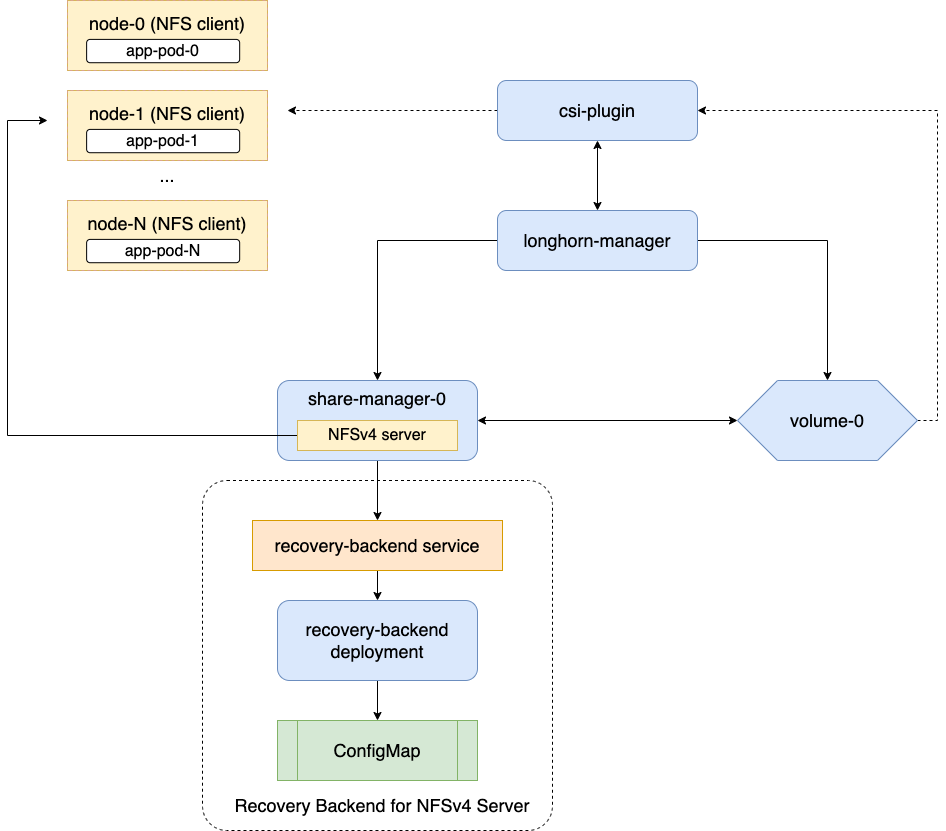

# ReadWriteMany Volumes

## Overview

Longhorn utilizes NFSv4 to implement persistent volumes with the `ReadWriteMany` access mode. As with iSCSI, this relies upon both kernel features and userspace utilities, typically provided by a package called either `nfs-utils` or `nfs-client` depending upon the Linux distro. `longhornctl check preflight` can be used against a running cluster to validate that node prerequisites are met.

A `share-manager` pod is created for each volume that is created with this access mode, providing the NFS server, which the engine instances then act as a client for.



## Demo

Create the resources:

```sh
kubectl create -f manifests/pods-with-rwx-volume.yaml
```

Observe that a `share-manager` pod running the NFS server appears once the PVC is bound and its pods come up:

```sh
kubectl get pod -n longhorn-system -l longhorn.io/component=share-manager
```
```
NAME                                                     READY   STATUS    RESTARTS   AGE
share-manager-pvc-40a6454e-fcd5-4a2c-84e9-93f62c15ca8f   1/1     Running   0          2m20s
```

The suffix matches the `PersistentVolume` that the claim gets bound to:

```sh
kubectl get pv pvc-40a6454e-fcd5-4a2c-84e9-93f62c15ca8f
```
```
NAME                                       CAPACITY   ACCESS MODES   RECLAIM POLICY   STATUS   CLAIM                            STORAGECLASS   VOLUMEATTRIBUTESCLASS   REASON   AGE
pvc-40a6454e-fcd5-4a2c-84e9-93f62c15ca8f   2Gi        RWX            Delete           Bound    longhorn-demo/longhorn-rwx-pvc   longhorn       <unset>
```
