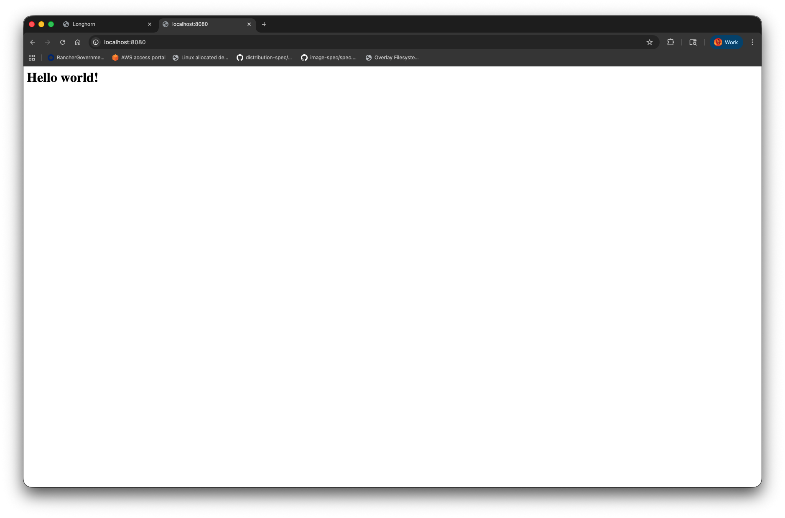

# Longhorn volumes in action

First, create a namespace that resources will reside in:

```sh
kubectl create ns longhorn-demo
```

## Create resources with peristent storage

```sh
kubectl create -f manifests/statefulset.yaml
```

This creates a `StatefulSet` with two pods, each of which is attached to its own data volume. The pods run `nginx` and the volumes stores the static web data. In this case, the volumes would start out empty, so an init container is added that checks for the existence of an `index.html` file and writes one if it does not exist. No mechanism is provided to keep these in sync with each other. In a real website, this would typically be accomplished by including static assets in the container image, with dynamic content stored in a database. `PersistentVolume` resources attached to individual pods like this would be used for local caching of content that can tolerate eventual consistency.

From the remote host, we can see that Longhorn has created `Volume` CRs:

```sh
kubectl get volumes.longhorn.io -n longhorn-system
```
```
pvc-5d10b78c-0f44-4d6b-88e6-f38b21dca151   v1            attached   healthy                  1073741824   ip-172-31-43-85.ec2.internal   47m
pvc-6ab4c383-fda1-4c95-b1a1-e3c5450400da   v1            attached   healthy                  1073741824   ip-172-31-43-85.ec2.internal   47m
```

We should also see four `Replica` CRs, since we set the default storage class to have two per volume:

```sh
kubectl get replicas.longhorn.io -n longhorn-system
```
```
NAME                                                  DATA ENGINE   STATE     NODE                           DISK                                   INSTANCEMANAGER                                     IMAGE                                AGE
pvc-5d10b78c-0f44-4d6b-88e6-f38b21dca151-r-67ec9def   v1            running   ip-172-31-43-85.ec2.internal   258d53fc-faa0-4b26-847b-d7830d8fde40   instance-manager-3320698e8605eb0ac2c1deabe9242ec2   longhornio/longhorn-engine:v1.10.0   48m
pvc-5d10b78c-0f44-4d6b-88e6-f38b21dca151-r-7e4c39be   v1            running   ip-172-31-43-85.ec2.internal   258d53fc-faa0-4b26-847b-d7830d8fde40   instance-manager-3320698e8605eb0ac2c1deabe9242ec2   longhornio/longhorn-engine:v1.10.0   48m
pvc-6ab4c383-fda1-4c95-b1a1-e3c5450400da-r-696a0c50   v1            running   ip-172-31-43-85.ec2.internal   258d53fc-faa0-4b26-847b-d7830d8fde40   instance-manager-3320698e8605eb0ac2c1deabe9242ec2   longhornio/longhorn-engine:v1.10.0   48m
pvc-6ab4c383-fda1-4c95-b1a1-e3c5450400da-r-fd2825a5   v1            running   ip-172-31-43-85.ec2.internal   258d53fc-faa0-4b26-847b-d7830d8fde40   instance-manager-3320698e8605eb0ac2c1deabe9242ec2   longhornio/longhorn-engine:v1.10.0   48m
```

We can see the naming convention is `VOLUME_NAME-r-HASH` where `VOLUME_NAME` is the name of both the Longhorn `Volume` CR and the Kubernetes `PeristentVolume`, which we can also see:

```sh
kubectl get pv
```
```
NAME                                       CAPACITY   ACCESS MODES   RECLAIM POLICY   STATUS   CLAIM                     STORAGECLASS   VOLUMEATTRIBUTESCLASS   REASON   AGE
pvc-5d10b78c-0f44-4d6b-88e6-f38b21dca151   1Gi        RWO            Delete           Bound    longhorn-demo/www-web-1   longhorn       <unset>                          51m
pvc-6ab4c383-fda1-4c95-b1a1-e3c5450400da   1Gi        RWO            Delete           Bound    longhorn-demo/www-web-0   longhorn       <unset>                          51m
```

Though `PersistentVolumeClaim` resources are namespaced and will exist in the same namespace as the pods they attach to, the `PersistentVolume` resources are not namespaced and the Longhorn `Volume` and `Replica` CRs will always exist in the `longhorn-system` namespace.

## Data persistence

Recall that the fundamental purpose of a `PersistentVolume` in Kubernetes is to get around the fact that the writable layer in a container itself is ephemeral. When the container is destroyed, any data written to it is also destroyed. The `PersistentVolume` allows externally-persisted storage to be mounted inside of a pod such that it outlives the pod. We can observe this by visiting the website we created. First, forward the service port 80 to 8080 on the localhost:

```sh
kubectl port-forward -n longhorn-demo svc/nginx 8080:80
```

Then navigate to http://localhost:8080 and you should see the website created by the init container:



If we delete the pods, this website should still exist when `nginx` comes back up in the new pods. First, however, we want to remove the init container from the pod spec, because it would create a new website if the old one is gone:

```sh
kubectl patch statefulset web \
  -n longhorn-demo \
  -p '{"spec":{"template":{"spec":{"initContainers":[]}}}}' \
  --type=merge
```

Now delete the pods:

```sh
kubectl scale statefulset web -n longhorn-demo --replicas=0
```

Scale back up to recreate them:

```sh
kubectl scale statefulset web -n longhorn-demo --replicas=2
```

If you watch the pods get created, you should now see no init stage. When at least one pod is ready, the service will forward to it, so refresh the web page and it should still be there (restart the port forward if necessary).

## Backing disk resources

On the cluster node itself, we can now see the block devices that were created by the `longhorn-engine`, along with their mount points.

```
[root@ip-172-31-43-85 ~]# lsblk
NAME MAJ:MIN RM  SIZE RO TYPE MOUNTPOINTS
sda    8:0    0    1G  0 disk /var/lib/kubelet/pods/ab65343b-6368-4754-997c-5069ede552ee/volumes/kubernetes.io~csi/pvc-6ab4c383-fda1-4c95-b1a1-e3c5450400da/mount
                              /var/lib/kubelet/plugins/kubernetes.io/csi/driver.longhorn.io/b9d26801e808c74a3de4d34b9a0ffe8e3960029f0c62d023e0c70e7c
                              a8deec30/globalmount
sdb    8:16   0    1G  0 disk /var/lib/kubelet/pods/05084abf-a571-4059-92e8-598989494159/volumes/kubernetes.io~csi/pvc-5d10b78c-0f44-4d6b-88e6-f38b21dca151/mount
                              /var/lib/kubelet/plugins/kubernetes.io/csi/driver.longhorn.io/09d504a83e6b85590ba368dbde6d329545ab6da116a80b3ecda8dd33
                              c0b49693/globalmount
```

We see there now exist device nodes `/dev/sda` and `/dev/sdb`, corresponding to the two volumes. These block devices were created by the Longhorn engine, then mounted by the CSI driver to the mount point under `/var/lib/kubelet/plugins/kubernetes.io/csi/driver.longhorn.io/`, then bind-mounted from there to the pods they attach to by the `kubelet`, which are the mount points we see under `/var/lib/kubelet/pods/`.

These devices are created by the iSCSI initiator over the network from their true backing disk. We can see this by viewing the device info:

```
[[root@ip-172-31-43-85 ~]# PAGER="" udevadm info /dev/sda
P: /devices/platform/host0/session8/target0:0:0/0:0:0:1/block/sda
M: sda
U: block
T: disk
D: b 8:0
N: sda
L: 0
S: disk/by-id/wwn-0x60000000000000000e00000000010001
S: disk/by-diskseq/17
S: disk/by-uuid/b5585dfc-84c6-4193-913d-49bf8f4e46a9
S: disk/by-id/scsi-360000000000000000e00000000010001
S: disk/by-id/scsi-SIET_VIRTUAL-DISK_beaf11
S: disk/by-id/scsi-33000000100000001
S: disk/by-path/ip-10.42.0.19:3260-iscsi-iqn.2019-10.io.longhorn:pvc-6ab4c383-fda1-4c95-b1a1-e3c5450400da-lun-1
S: disk/by-id/scsi-1IET_00010001
Q: 17
E: DEVPATH=/devices/platform/host0/session8/target0:0:0/0:0:0:1/block/sda
E: DEVNAME=/dev/sda
E: DEVTYPE=disk
E: DISKSEQ=17
E: MAJOR=8
E: MINOR=0
E: SUBSYSTEM=block
E: USEC_INITIALIZED=5220723236
E: ID_SCSI=1
E: ID_VENDOR=IET
E: ID_VENDOR_ENC=IET\x20\x20\x20\x20\x20
E: ID_MODEL=VIRTUAL-DISK
E: ID_MODEL_ENC=VIRTUAL-DISK\x20\x20\x20\x20
E: ID_REVISION=0001
E: ID_TYPE=disk
E: ID_SERIAL=360000000000000000e00000000010001
E: ID_SERIAL_SHORT=60000000000000000e00000000010001
E: ID_WWN=0x6000000000000000
E: ID_WWN_VENDOR_EXTENSION=0x0e00000000010001
E: ID_WWN_WITH_EXTENSION=0x60000000000000000e00000000010001
E: ID_SCSI_SERIAL=beaf11
E: ID_BUS=scsi
E: ID_PATH=ip-10.42.0.19:3260-iscsi-iqn.2019-10.io.longhorn:pvc-6ab4c383-fda1-4c95-b1a1-e3c5450400da-lun-1
E: ID_PATH_TAG=ip-10_42_0_19_3260-iscsi-iqn_2019-10_io_longhorn_pvc-6ab4c383-fda1-4c95-b1a1-e3c5450400da-lun-1
E: ID_FS_UUID=b5585dfc-84c6-4193-913d-49bf8f4e46a9
E: ID_FS_UUID_ENC=b5585dfc-84c6-4193-913d-49bf8f4e46a9
E: ID_FS_VERSION=1.0
E: ID_FS_BLOCKSIZE=4096
E: ID_FS_LASTBLOCK=262144
E: ID_FS_TYPE=ext4
E: ID_FS_USAGE=filesystem
E: SCSI_TPGS=0
E: SCSI_TYPE=disk
E: SCSI_VENDOR=IET
E: SCSI_VENDOR_ENC=IET\x20\x20\x20\x20\x20
E: SCSI_MODEL=VIRTUAL-DISK
E: SCSI_MODEL_ENC=VIRTUAL-DISK\x20\x20\x20\x20
E: SCSI_REVISION=0001
E: ID_SCSI_INQUIRY=1
E: SCSI_IDENT_SERIAL=beaf11
E: SCSI_IDENT_LUN_T10=IET_00010001
E: SCSI_IDENT_LUN_NAA_LOCAL=3000000100000001
E: SCSI_IDENT_LUN_NAA_REGEXT=60000000000000000e00000000010001
E: MPATH_SBIN_PATH=/sbin
E: DM_MULTIPATH_DEVICE_PATH=0
E: DEVLINKS=/dev/disk/by-id/wwn-0x60000000000000000e00000000010001 /dev/disk/by-diskseq/17 /dev/disk/by-uuid/b5585dfc-84c6-4193-913d-49bf8f4e46a9 /dev/disk/by-id/scsi-360000000000000000e00000000010001 /dev/disk/by-id/scsi-SIET_VIRTUAL-DISK_beaf11 /dev/disk/by-id/scsi-33000000100000001 /dev/disk/by-path/ip-10.42.0.19:3260-iscsi-iqn.2019-10.io.longhorn:pvc-6ab4c383-fda1-4c95-b1a1-e3c5450400da-lun-1 /dev/disk/by-id/scsi-1IET_00010001
E: TAGS=:systemd:
E: CURRENT_TAGS=:systemd:
```

Note the IP in the device paths, 10.42.0.19. This is the IP of the instance manager pod:

```
[root@ip-172-31-43-85 ~]# kubectl get pod -n longhorn-system -l longhorn.io/component=instance-manager -o=jsonpath="{range .items[*]}{.status.podIP}"
10.42.0.19
```

We can also see this by looking directly at `/dev/disk/by-path/`:

```
[root@ip-172-31-43-85 ~]# ls /dev/disk/by-path
ip-10.42.0.19:3260-iscsi-iqn.2019-10.io.longhorn:pvc-5d10b78c-0f44-4d6b-88e6-f38b21dca151-lun-1  pci-0000:00:04.0-nvme-1-part4
ip-10.42.0.19:3260-iscsi-iqn.2019-10.io.longhorn:pvc-6ab4c383-fda1-4c95-b1a1-e3c5450400da-lun-1  pci-0000:00:1e.0-nvme-1
pci-0000:00:04.0-nvme-1                                                                          pci-0000:00:1e.0-nvme-1-part1
pci-0000:00:04.0-nvme-1-part1                                                                    pci-0000:00:1f.0-nvme-1
pci-0000:00:04.0-nvme-1-part2                                                                    pci-0000:00:1f.0-nvme-1-part1
pci-0000:00:04.0-nvme-1-part3
```

We can see all of the local devices have paths corresponding to a PCI bus, whereas the iSCSI devices have a path corresponding to an IP address. We can also see the data in all of its various locations. First the global mount to the cluster node created by the CSI driver:

```
[root@ip-172-31-43-85 ~]# ls /var/lib/kubelet/plugins/kubernetes.io/csi/driver.longhorn.io/b9d26801e808c74a3de4d34b9a0ffe8e3960029f0c62d023e0c70e7ca8deec30/globalmount
index.html  lost+found
[root@ip-172-31-43-85 ~]# cat /var/lib/kubelet/plugins/kubernetes.io/csi/driver.longhorn.io/b9d26801e808c74a3de4d34b9a0ffe8e3960029f0c62d023e0c70e7ca8deec30/globalmount/index.html
<h1>Hello world!</h1>
```

Then the bind mount into the pod:

```
[root@ip-172-31-43-85 ~]# ls /var/lib/kubelet/pods/ab65343b-6368-4754-997c-5069ede552ee/volumes/kubernetes.io~csi/pvc-6ab4c383-fda1-4c95-b1a1-e3c5450400da/mount
index.html  lost+found
[root@ip-172-31-43-85 ~]# cat /var/lib/kubelet/pods/ab65343b-6368-4754-997c-5069ede552ee/volumes/kubernetes.io~csi/pvc-6ab4c383-fda1-4c95-b1a1-e3c5450400da/mount/index.html
<h1>Hello world!</h1>
```

Finally, we can see the replicas themselves, which serve as the backing images for the iSCSI targets created by the `longhorn-manager`. These exist under `/var/lib/longhorn/replicas/`.

```
[root@ip-172-31-43-85 ~]# ls /var/lib/longhorn/replicas/
pvc-5d10b78c-0f44-4d6b-88e6-f38b21dca151-4b1b86ba  pvc-6ab4c383-fda1-4c95-b1a1-e3c5450400da-644f7035
pvc-5d10b78c-0f44-4d6b-88e6-f38b21dca151-eecc3fc9  pvc-6ab4c383-fda1-4c95-b1a1-e3c5450400da-e14bb0c8
```

In this case, it won't matter which we look at, since they all contain the same data, but we will pick the one corresponding to `/dev/sda` that we looked at earlier, which is associated with the `PersistentVolume` `pvc-6ab4c383-fda1-4c95-b1a1-e3c5450400da`, a fact we can incur from the presence of that string in its path. We see there are two replicas associated with that volume, as expected. In a multi-node cluster, these would exist on different nodes, and in many cases on separate disks, but we have a simplified installation for the demo.

```
[root@ip-172-31-43-85 ~]# ls /var/lib/longhorn/replicas/pvc-6ab4c383-fda1-4c95-b1a1-e3c5450400da-644f7035
volume-head-000.img  volume-head-000.img.meta  volume.meta
```

Longhorn stores replicas as an ordered sequence of snapshots, but since this volume was only recently created and has no snapshots, the head is the only image in there. We can mount it to the node using a local mount instead of via iSCSI and observe the same data as seen by the pod:

```
[root@ip-172-31-43-85 ~]# mount -o loop /var/lib/longhorn/replicas/pvc-6ab4c383-fda1-4c95-b1a1-e3c5450400da-644f7035/volume-head-000.img /mnt
[root@ip-172-31-43-85 ~]# ls /mnt
index.html  lost+found
[root@ip-172-31-43-85 ~]# cat /mnt/index.html
<h1>Hello world!</h1>
```

Ultimately, the `longhorn-manager` creates this disk image and exposes it over the Kubernetes cluster network as an iSCSI target, which the `longhorn-engine` exposes to its local cluster node as a block device, the CSI driver mounts to the host filesystem hierarchy, and the `kubelet` bind mounts to the pod.

We can also observe Longhorn's thin provisioning in action by looking at the disk usage of the replica:

```
[root@ip-172-31-43-85 ~]# du -h /var/lib/longhorn/replicas/pvc-6ab4c383-fda1-4c95-b1a1-e3c5450400da-644f7035/volume-head-000.img
49M	/var/lib/longhorn/replicas/pvc-6ab4c383-fda1-4c95-b1a1-e3c5450400da-644f7035/volume-head-000.img
```

We see that a 1Gi volume only consumes 49Mi on disk, due to Longhorn using the sparse file support of the filesystem, in this case `ext4`. If we exc into the pod, we will see that the space available appears as expected:

```sh
kubectl exec -it -n longhorn-demo web-0 -- /bin/sh
```
```
# df -h /usr/share/nginx/html
Filesystem                                              Size  Used Avail Use% Mounted on
/dev/longhorn/pvc-6ab4c383-fda1-4c95-b1a1-e3c5450400da  974M   28K  958M   1% /usr/share/nginx/html
```

Subtracting the filesystem metadata from the allocated 1Gi, 974M is available, in spite of a backing image on disk that only consumes 49M

## Longhorn Engine

Go back on the cluster node and we can see all of the `longhorn-engine` instances:

```
[root@ip-172-31-43-85 ~]# ps -aeo args | grep '^/host/var/lib/longhorn/engine-binaries/longhornio-longhorn-engine-v1.10.0/longhorn' | sed 's/--/\n  --/g'
/host/var/lib/longhorn/engine-binaries/longhornio-longhorn-engine-v1.10.0/longhorn
  --volume-name pvc-6ab4c383-fda1-4c95-b1a1-e3c5450400da replica /host/var/lib/longhorn/replicas/pvc-6ab4c383-fda1-4c95-b1a1-e3c5450400da-644f7035
  --size 1073741824
  --disableRevCounter
  --replica-instance-name pvc-6ab4c383-fda1-4c95-b1a1-e3c5450400da-r-fd2825a5
  --snapshot-max-count 250
  --snapshot-max-size 0
  --sync-agent-port-count 7
  --listen :10147
/host/var/lib/longhorn/engine-binaries/longhornio-longhorn-engine-v1.10.0/longhorn
  --volume-name pvc-6ab4c383-fda1-4c95-b1a1-e3c5450400da sync-agent
  --listen :10149
  --replica :10147
  --listen-port-range 10150-10156
  --replica-instance-name pvc-6ab4c383-fda1-4c95-b1a1-e3c5450400da-r-fd2825a5
/host/var/lib/longhorn/engine-binaries/longhornio-longhorn-engine-v1.10.0/longhorn
  --volume-name pvc-6ab4c383-fda1-4c95-b1a1-e3c5450400da replica /host/var/lib/longhorn/replicas/pvc-6ab4c383-fda1-4c95-b1a1-e3c5450400da-e14bb0c8
  --size 1073741824
  --disableRevCounter
  --replica-instance-name pvc-6ab4c383-fda1-4c95-b1a1-e3c5450400da-r-696a0c50
  --snapshot-max-count 250
  --snapshot-max-size 0
  --sync-agent-port-count 7
  --listen :10157
/host/var/lib/longhorn/engine-binaries/longhornio-longhorn-engine-v1.10.0/longhorn
  --volume-name pvc-6ab4c383-fda1-4c95-b1a1-e3c5450400da sync-agent
  --listen :10159
  --replica :10157
  --listen-port-range 10160-10166
  --replica-instance-name pvc-6ab4c383-fda1-4c95-b1a1-e3c5450400da-r-696a0c50
/host/var/lib/longhorn/engine-binaries/longhornio-longhorn-engine-v1.10.0/longhorn
  --volume-name pvc-5d10b78c-0f44-4d6b-88e6-f38b21dca151 replica /host/var/lib/longhorn/replicas/pvc-5d10b78c-0f44-4d6b-88e6-f38b21dca151-eecc3fc9
  --size 1073741824
  --disableRevCounter
  --replica-instance-name pvc-5d10b78c-0f44-4d6b-88e6-f38b21dca151-r-67ec9def
  --snapshot-max-count 250
  --snapshot-max-size 0
  --sync-agent-port-count 7
  --listen :10168
/host/var/lib/longhorn/engine-binaries/longhornio-longhorn-engine-v1.10.0/longhorn
  --volume-name pvc-5d10b78c-0f44-4d6b-88e6-f38b21dca151 sync-agent
  --listen :10170
  --replica :10168
  --listen-port-range 10171-10177
  --replica-instance-name pvc-5d10b78c-0f44-4d6b-88e6-f38b21dca151-r-67ec9def
/host/var/lib/longhorn/engine-binaries/longhornio-longhorn-engine-v1.10.0/longhorn
  --volume-name pvc-5d10b78c-0f44-4d6b-88e6-f38b21dca151 replica /host/var/lib/longhorn/replicas/pvc-5d10b78c-0f44-4d6b-88e6-f38b21dca151-4b1b86ba
  --size 1073741824
  --disableRevCounter
  --replica-instance-name pvc-5d10b78c-0f44-4d6b-88e6-f38b21dca151-r-7e4c39be
  --snapshot-max-count 250
  --snapshot-max-size 0
  --sync-agent-port-count 7
  --listen :10178
/host/var/lib/longhorn/engine-binaries/longhornio-longhorn-engine-v1.10.0/longhorn
  --volume-name pvc-5d10b78c-0f44-4d6b-88e6-f38b21dca151 sync-agent
  --listen :10180
  --replica :10178
  --listen-port-range 10181-10187
  --replica-instance-name pvc-5d10b78c-0f44-4d6b-88e6-f38b21dca151-r-7e4c39be
```

We see there are now 8 of these, corresponding to 2 replicas and 2 sync agents for each volume. There is some inconsistency here with the Longhorn documentation, which implies a new pod is created for each `longhorn-engine` instance, which may have been the case in the past. In Longhorn as it exists today, the instance manager is instead started with the containerized init process `tini`, which helps a single container launch and manage many processes.

An excerpt from `ps x --forest` shows the relationship:

```
22186 ?        Sl     0:06 /var/lib/rancher/k3s/data/86a616cdaf0fb57fa13670ac5a16f1699f4b2be4772e842d97904c69698ffdc2/bin/containerd-shim-runc-v2
  27261 ?        Ss     0:00  \_ /tini -- instance-manager --debug daemon --listen :8500
  27274 ?        Sl     1:54      \_ longhorn-instance-manager --debug daemon --listen :8500
  27278 ?        Sl     0:01          \_ tgtd -f
  27279 ?        S      0:00          \_ tee /var/log/tgtd.log
 112758 ?        Sl     0:00          \_ /host/var/lib/longhorn/engine-binaries/longhornio-longhorn-engine-v1.10.0/longhorn --volume-name pvc-6ab4c3
 112767 ?        Sl     0:01          |   \_ /host/var/lib/longhorn/engine-binaries/longhornio-longhorn-engine-v1.10.0/longhorn --volume-name pvc-6a
 112790 ?        Sl     0:00          \_ /host/var/lib/longhorn/engine-binaries/longhornio-longhorn-engine-v1.10.0/longhorn --volume-name pvc-6ab4c3
 112799 ?        Sl     0:01          |   \_ /host/var/lib/longhorn/engine-binaries/longhornio-longhorn-engine-v1.10.0/longhorn --volume-name pvc-6a
 112841 ?        Sl     0:04          \_ /engine-binaries/longhornio-longhorn-engine-v1.10.0/longhorn --engine-instance-name pvc-6ab4c383-fda1-4c95-
 113362 ?        Sl     0:00          \_ /host/var/lib/longhorn/engine-binaries/longhornio-longhorn-engine-v1.10.0/longhorn --volume-name pvc-5d10b7
 113371 ?        Sl     0:01          |   \_ /host/var/lib/longhorn/engine-binaries/longhornio-longhorn-engine-v1.10.0/longhorn --volume-name pvc-5d
 113385 ?        Sl     0:00          \_ /host/var/lib/longhorn/engine-binaries/longhornio-longhorn-engine-v1.10.0/longhorn --volume-name pvc-5d10b7
 113403 ?        Sl     0:01          |   \_ /host/var/lib/longhorn/engine-binaries/longhornio-longhorn-engine-v1.10.0/longhorn --volume-name pvc-5d
 113444 ?        Sl     0:04          \_ /engine-binaries/longhornio-longhorn-engine-v1.10.0/longhorn --engine-instance-name pvc-5d10b78c-0f44-4d6b-
```

These are extremely lightweight processes. We can see the processor and memory consumption of all of them:

```
[root@ip-172-31-43-85 ~]# ps -eo pid,%cpu,%mem | grep -E '22186|27261|27274|27278|27279|112758|112767|112790|112799|112841|113362|113371|113385|113403|113444'
  22186  0.0  0.1
  27261  0.0  0.0
  27274  1.7  0.4
  27278  0.0  0.0
  27279  0.0  0.0
 112758  0.0  0.2
 112767  0.0  0.2
 112790  0.0  0.2
 112799  0.0  0.2
 112841  0.2  0.2
 113362  0.0  0.2
 113371  0.0  0.2
 113385  0.0  0.2
 113403  0.0  0.2
 113444  0.2  0.2
```

Cumulatively, about 2% each of a core and RAM on a host with 4 cores and 16Gi of RAM (15Gi non-reserved).
